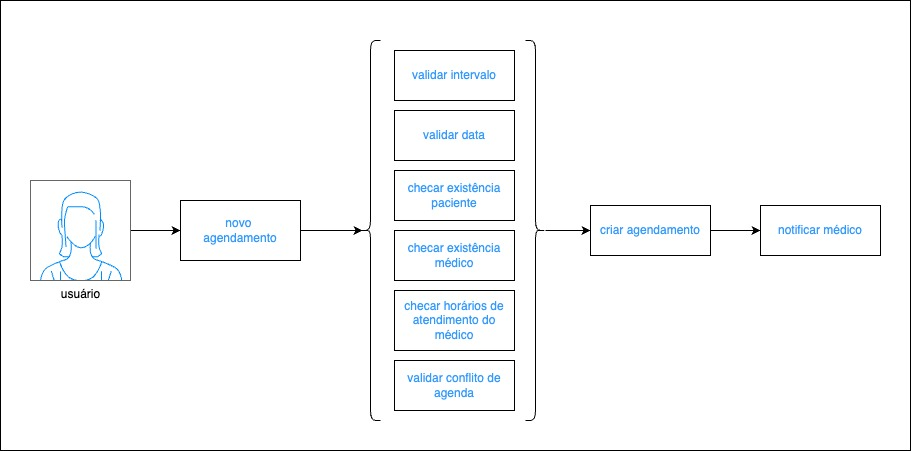
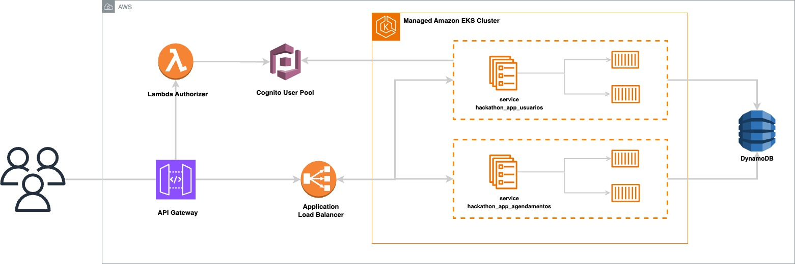

# 🚀 FIAP : Hackathon Pós-Tech Software Architecture

## 🩺 Projeto Health&Med | Serviço de Agendamento de Consultas

Projeto realizado para a Pós-Graduação de Arquitetura de Sistemas da FIAP. Criação de um sistema de agendamentos de consultas.

 

### 👨‍🏫 Grupo

Integrantes:

- Giovanna H. B. Albuquerque (RM352679)

 

### ✍️ MVP: Premissas

Tratando-se de um MVP, e com tempo de execução limitado (2 semanas), algumas premissas foram criadas para delimitar com precisão o escopo e tornar possível a entrega dos requisitos funcionais e não funcionais sem abrir mão da qualidade do que foi criado.

São elas:

- O campo E-mail precisa ser único;
- O campo CPF precisa ser único;
- Agendamentos só podem ser feitos de hora em hora;
- Todos os agendamentos ocupam 1h;
- Os horários permitidos vão das 7h às 19h;
- Agendamentos só podem ser feitos de Segunda a Sábado;
- Não é possível remarcar consultas.

 

### ✉️ Fluxograma: criação de agendamento

Desenho do fluxo da criação de um agendamento e as validações executadas:

 

### 📐 Desenho de Solução (Arquitetura)

Solução arquitetônica realizada (Cloud AWS) completa:

 

### 💻 Tecnologias

Tecnologias utilizadas no projeto:

* Pipeline Github Actions
* Terraform
* Cloud AWS
* Python
* Java
* Spring Framework
* Kubernetes

 

## 🎬 Como executar este projeto?

Compõem esta entrega:

* Repositório da Lambda de Autenticação

    * https://github.com/GHBAlbuquerque/fiap_postech_hackathon_lambda_auth

* Repositório da Infra (EKS, Load Balancer, Security Group)

    * https://github.com/GHBAlbuquerque/fiap_postech_hackathon_infra_eks

* Repositório da Infra (ApiGateway e Cognito User Pools)

    * https://github.com/GHBAlbuquerque/fiap_postech_hackathon_infra_gateway

* Repositório das Tabelas Dynamo

    * https://github.com/GHBAlbuquerque/fiap_postech_hackathon_infra_dynamo

* Repositório da App de Usuários

    * https://github.com/GHBAlbuquerque/fiap_postech_hackathon_app_usuarios

* Repositório da App de Produto

    * https://github.com/GHBAlbuquerque/fiap_postech_hackathon_app_agendamentos

 

### 💿 Getting started - Rodando com CI/CD e infra descentralizada na Cloud AWS

Faça o download ou clone este projeto e abra em uma IDE (preferencialmente IntelliJ).

É preciso ter:

    - Uma conta cadastrada na Cloud AWS / AWS Academy

 

Antes de iniciar:

1. Crie manualmente bucket s3 na conta com para guardar os states do terraform (utilizei o nome
   ‘terraform-state-backend-postech’)
2. Crie manualmente repositórios ECR na conta com os nomes ‘fiap_postech_hackathon_app_usuarios’ e ‘fiap_postech_hackathon_app_agendamentos’
3. Caso não esteja usando AWS Academy, é necessário criar também Policies e Roles para os serviços. Esta etapa não foi
   feita na entrega da Pós e foram usadas as Roles padrão do laboratório.

Passo-a-passo:

1. Obtenha credenciais de aws_access_key_id, aws_secret_access_key e aws_session_token da sua conta na AWS Academy ou na
   AWS.
2. Altere credenciais nos secrets para actions dos repositórios
3. Altere credenciais no arquivo .credentials na pasta .aws no seu computador caso deseje rodar a aplicação localmente
   ou usar o aws cli

 

> Subindo a Infraestrutura do projeto (LoadBalancer, Security Group e EKS Cluster)

1. Ajuste o bucket para armazenamento de estado **Repositório da Infra EKS**
    1. backend "s3" { bucket = "${SEU BUCKET}" ... } -> arquivo main.tf
2. Ajuste variáveis e segredos de Actions para CI/CD no arquivo terraform.tfvars
3. Suba infraestrutura via CICD do repositório (LoadBalancer, Security Group e EKS Cluster)
4. Ajuste o Security Group gerado automaticamente pelo cluster
    1. Libere 'Todo o Tráfego' para a VPC (ver CIDR)
    2. Libere 'Todo o Tráfego' para o Security Group criado manualmente e usado no ALB (obter id do security group)

 

> Subindo as tabelas Dynamo

1. Ajuste o bucket para armazenamento de estado **Repositório das Tabelas Dynamo**
    1. backend "s3" { bucket = "${SEU BUCKET}" ... } -> arquivo main.tf
2. Ajuste variáveis e segredos de Actions para CI/CD no arquivo terraform.tfvars
3. Suba infraestrutura via CICD do repositório

 

> Subindo a App de Usuários

1. Abra o projeto no **Repositório da App de Usuários**
2. No arquivo infra-kubernetes/manifest.yaml, no Deployment, em spec.templates.spec.containers.image:
    1. Ajuste URI do repositório remoto ECR AWS (accountId e region)
3. No arquivo infra-kubernetes/manifest.yaml, no Deployment, em spec.templates.spec.containers.env:
    2. Corrija COGNITO_ID mudando o valor do ClientId do Cognito
    3. Corrija ACCOUNT_ID mudando o id da conta AWS
4. Suba a aplicação via CI/CD do repositório
5. (opcional) Use o comando ``aws eks --region us-east-1  update-kubeconfig --name eks_cluster_fiap_postech`` no
   terminal para acessar seu cluster. Digite ``k9s`` para visualizar e gerenciar pods em execução.

 

> Subindo a App de Agendamentos

1. Abra o projeto no **Repositório da App de Agendamentos**
2. Al[em das informações de login na AWS para execução da pipeline, preencha também:
   1. SMTP_MAIL -> E-mail para disparo de notificações pela app
   2. SMTP_MAIL_PASSWORD -> senha do e-mail para disparo de notificações
3. No arquivo infra-kubernetes/manifest.yaml, no Deployment, em spec.templates.spec.containers.image:
    1. Ajuste URI do repositório remoto ECR AWS (accountId e region)
    2. Corrija ACCOUNT_ID mudando o id da conta AWS
    3. Ajuste o endereço de chamada (DNS do loadblancer) para o MS Usuário (MS_USUARIO_URL)
4. Suba a aplicação via CI/CD do repositório
5. (opcional) Use o comando ``aws eks --region us-east-1  update-kubeconfig --name eks_cluster_fiap_postech`` no
   terminal para acessar seu cluster. Digite ``k9s`` para visualizar e gerenciar pods em execução.

> Subindo a Lambda de Autenticação

1. Ajuste o bucket para armazenamento de estado **Repositório da Lambda de Autenticação**
    1. backend "s3" { bucket = "${SEU BUCKET}" ... } -> arquivo main.tf
2. Ajuste variáveis e segredos de Actions para CI/CD no arquivo terraform.tfvars
3. Suba a lambda via CICD do repositório
4. Após a criação do Cognito no passo 'Subindo a Infraestrutura do projeto (Api Gateway e Cognito User Pools)':
    1. Obtenha o ID do Cliente do Cognito na aba 'Integração da Aplicação', sessáo 'Análise e clientes de aplicação'
    2. Mude o ClientId do cognito -> arquivo lambda_auth.py (client_id)
5. Faça deploy da Lambda novamente

 

> Subindo a Infraestrutura do projeto (Api Gateway e Cognito User Pools)

1. Ajuste o bucket para armazenamento de estado **Repositório da Infra**
    1. backend "s3" { bucket = "${SEU BUCKET}" ... } -> arquivo main.tf
2. Ajuste variáveis e segredos de Actions para CI/CD no arquivo terraform.tfvars
3. Suba infraestrutura via CICD do repositório (Api Gateway e Cognito User Pools)
4. Ajuste um bug do autorizador do API Gateway que mostra erro 500 e mensagem ‘null’:
    1. Vá em ‘Autorizadores’
    2. Selecione ‘lambda_authorizer_cpf’ e editar
    3. Escolha a função lambda da lista
    4. Salve alterações
    5. Realize deploy da API no estágio ("Implantar API")
5. Teste a conexão chamando o DNS do loadbalancer na url: ``{DNS Load Balancer}/actuator/health``
6. Obtenha endereço do stage do API Gateway no console para realizar chamadas
    1. Vá em API Gateway > api_gateway_fiap_postech > estágios > pegar o valor 'Invoke Url'

 

> Utilizando a API

1. Copie o conteúdo do arquivo misc/API/openapi.json
2. Vá para o site 'https://editor.swagger.io/' e cole o json copiado na esquerda
3. Veja os endpoints disponíveis para a API
4. Para realizar chamadas aos endpoints http do gateway, utilize a 'Invoke URL' e os seguintes headers:
    1. user_email -> valor cadastrado previamente: 93678719023
    2. user_pword -> valor cadastrado previamente: FIAPauth123_

 

> (opcional) Criar usuário e utilizar

1. Crie um usuário utilizando o endpoint POST '/doctors' ou '/patients'
2. O username será o e-mail informado
3. Pegue o código de verificação enviado para o e-mail
4. Confirme a criação do usuário para permitir o uso em endpoints: envie uma requisição para o endpoint POST '/authenticate' (utilizando e-mail e o código)
5. Utilize o e-mail e senha cadastrados para fazer solicitações como orientado acima

 

## Autores

*Giovanna Albuquerque* [@GHBAlbuquerque](https://github.com/GHBAlbuquerque)

*FIAP*  [@FIAP Software Architecture](https://postech.fiap.com.br/curso/software-architecture/)

Feito em 2024